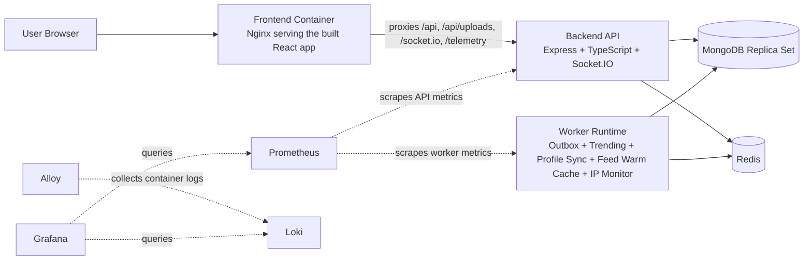
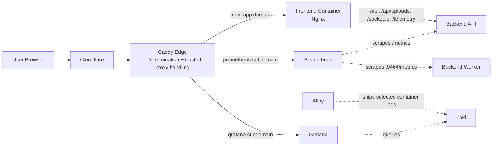

# Ascendance

> A full-stack social platform built to explore the problems that show up beyond CRUD.

[](https://www.typescriptlang.org/)
[](https://nodejs.org/)
[](https://react.dev/)
[](https://www.mongodb.com/)
[](https://redis.io/)
[](https://www.docker.com/)
[](https://prometheus.io/)
[](https://grafana.com/)

## About The Project

This is not a landing page portfolio project and it's not a wrapper around a database. Ascendance is a social product with real-time messaging, notifications, communities, favorites, profile management, admin tooling, multilingual UI, background processing, and production-style monitoring.

The repo is intentionally opinionated where it matters:

- CQRS on the backend for clearer read/write flows.
- Transaction-aware side effects through an outbox worker.
- Redis used for more than caching: sessions, fan-out support, notification state, and hot-path protection.
- Frontend instrumentation, lazy route loading, and i18n built into the app shell.
- Dockerized local and production-oriented deployment flows.

## What Changed Recently

The codebase recently went through both observability hardening and a broad
backend responsibility split. The current project shape is:

- No dedicated API gateway anymore. The frontend container serves the built React app and proxies API, upload, WebSocket, and telemetry traffic directly to the backend.
- The monorepo now centers on two workspaces: `backend` and `frontend`.
- Workers can run in-process during app startup, or as a dedicated `backend-worker` container in Docker deployments.
- The broad `user.repository.ts` and unused `post.service.ts` were removed. User reads now live in `UserReadRepository`, while handlers depend on narrow lookup/suggestion ports instead of one oversized repository contract.
- Redis consumers now depend on focused capabilities for auth sessions, feed caching, user lookup, user suggestions, and trending-stream/cache operations.
- Account deletion and banning remain one transaction, but cleanup is delegated to content, social, conversation, community, record, and outbox participants.
- Trending processing is split into stream consumption, score policy/projection, and Redis storage while keeping one restartable worker lifecycle owner.
- Request completion now fans out to separate request-audit, optional request-log persistence, and throttled user-activity paths. Production disables high-volume request-log persistence by default without disabling security/auth audits.
- Outbox events use stable explicit event types, exponential backoff with jitter, terminal exhaustion state, backlog metrics, and an operator requeue command.
- Structured JSON error logging now has bounded/redacted metadata, request-context correlation, one terminal HTTP owner, worker/process terminal boundaries, and Loki/Alloy collection with a provisioned Grafana logs dashboard.
- The frontend gained stronger retry/error states, protected-login return paths, token-fragment cleanup, debounced searches, safer telemetry requeueing, a focused messaging conversation-list component, and a real not-found route.
- Production deployment now uses immutable commit-SHA image tags, serialized deploys, host fingerprint verification, preflight checks, and post-deploy image assertions.

## Architecture At A Glance



This is the containerized runtime view. In local development, the Vite dev server replaces the frontend container and proxies to the dynamically selected backend port. In production compose, an outer edge/TLS layer can sit in front of the frontend container, but it is omitted here so the primary application runtime stays readable.

### Production Edge View



The production edge is more specific than the runtime view above: Caddy terminates TLS, trusts Cloudflare proxy headers, forwards the real client IP downstream, sends app traffic to the frontend container, and exposes Prometheus and Grafana on separate subdomains.

### Current Runtime Shape

| Layer       | What runs now                                | Why it matters                                                                        |
| ----------- | -------------------------------------------- | ------------------------------------------------------------------------------------- |
| Edge (prod) | Cloudflare-aware Caddy ingress               | TLS termination, trusted proxy handling, and subdomain routing for app and monitoring |
| Frontend    | Nginx serving the built React app            | Handles static delivery and same-origin proxying without a separate gateway           |
| API         | Express + Socket.IO backend                  | HTTP API, auth, uploads, read/write flows, real-time events, telemetry                |
| Workers     | Same backend codebase, separate runtime mode | Isolates async processing and lets the API stay focused on request handling           |
| Data        | MongoDB replica set + Redis                  | Transactions, caching, session state, queue-like coordination                         |
| Monitoring  | Prometheus + Grafana + Loki + Alloy          | Metrics, bounded structured logs, and provisioned operational dashboards              |

## Product Surface

Ascendance currently includes:

- Personalized home feed and discovery flows.
- Communities and community membership views.
- Post creation, favorites, comments, and post detail pages.
- Real-time messaging and notifications.
- Rich profile editing, follow graphs, avatar and cover updates.
- Admin dashboard and per-user admin detail screens.
- English and Bulgarian UI localization.

## Engineering Highlights

### Backend

- TypeScript + Express with `tsyringe`-based dependency injection.
- CQRS-style application layer with commands, queries, handlers, and bus wiring.
- Transaction-aware Unit of Work patterns on MongoDB.
- Narrow read/write repositories, application ports, and Redis capability adapters.
- Transactional account-lifecycle participants for content, social, conversation, community, record, and outbox cleanup.
- Outbox processing with stable event names, ownership-safe claims, resumable handler progress, delayed retry, exhaustion metrics, and manual requeue support.
- Redis-backed session management, cache coordination, real-time support, feed structures, and consumer-group streaming.
- Split request auditing, optional request-log persistence, and throttled user-activity updates.
- Health, metrics, telemetry, correlation-aware structured logging, and non-HTTP terminal error boundaries.

### Frontend

- React 18 + Vite + TypeScript.
- Route-level lazy loading and error boundaries in the app shell.
- TanStack Query for server-state orchestration.
- Material UI with Emotion for component styling.
- Socket.IO client integration for live features.
- i18next-based language detection and translation resources.
- Retryable feed/notification/message states, protected-route return navigation, semantic rich-text links, and URL-fragment token cleanup.
- Stable swipe gesture listeners, safer media-preview lifecycle handling, debounced high-churn inputs, and telemetry delivery requeueing.

### Infra And Operations

- `docker-compose-dev.yml` for a local full-stack replica-set environment.
- Separate production-oriented Compose file.
- Production ingress uses Caddy for TLS termination, trusted proxy handling, and routing to the app plus monitoring subdomains.
- Prometheus, Grafana, Loki, and Alloy are included in-repo; monitoring host ports are loopback-only.
- Production images are deployed by immutable Git SHA and the worker has a metrics-based health check.
- Nginx serving the built frontend and proxying API, uploads, telemetry, and WebSocket traffic directly to the backend.

## Trade-Offs, On Purpose

This codebase deliberately explores patterns that are more advanced than the smallest version of the product would need. That is part of the point.

- CQRS improves clarity in several hot paths, but it also raises the maintenance bar.
- The outbox protects consistency for async work, but it adds operational surface area.
- Redis-heavy optimizations only justify themselves when measured.
- Dedicated workers simplify scaling and isolation, but they make deployment shape more explicit.

The value here is not "more architecture." The value is demonstrating where that architecture helps, where it costs, and how to keep the tradeoffs visible.

## Tech Stack

| Area     | Stack                                                                                    |
| -------- | ---------------------------------------------------------------------------------------- |
| Frontend | React, Vite, TypeScript, TanStack Query, Material UI, Emotion, Socket.IO client, i18next |
| Backend  | Node.js, Express, TypeScript, TSyringe, Mongoose, Redis, Socket.IO, Zod, Winston         |
| Testing  | Mocha, Chai, Sinon, Supertest, Cypress                                                   |
| Infra    | Docker, Docker Compose, Nginx, Caddy, Prometheus, Grafana, Loki, Alloy                   |
| Storage  | MongoDB, Redis, Cloudinary in production, local uploads in development                   |

## Running The Project

### Prerequisites

- Node.js 20+ recommended.
- Docker and Docker Compose for containerized startup.
- MongoDB and Redis access if you are running locally without Docker.

### Quick Start With Docker

```bash
git clone https://github.com/sunsetstack/ascendance-social.git
cd ascendance-social
docker compose -f docker-compose-dev.yml up --build
```

After startup:

- App: `http://localhost:8080`
- Backend: `http://localhost:8000`

The monitoring profile is opt-in:

```bash
docker compose -f docker-compose-dev.yml --profile monitoring up --build
```

With that profile enabled, Prometheus is at `http://localhost:9090`, Grafana at
`http://localhost:3001`, Loki at `http://localhost:3100`, and Alloy at
`http://localhost:12345`. These monitoring ports bind to loopback.

The backend health endpoint is available internally to the stack at `/health` and is exposed directly during local non-Docker development.

### Local Development

Create a root `.env` with the values your backend needs.

```env
MONGODB_URI=mongodb://...
REDIS_URL=redis://localhost:6379
JWT_SECRET=replace-me
PORT=8000
FRONTEND_URL=http://localhost:5173
ALLOWED_ORIGINS=http://localhost,http://localhost:80,http://localhost:5173,http://localhost:5174,http://localhost:8000
ALLOW_INSECURE_COOKIES=false
MONGO_INITDB_ROOT_USERNAME=replace-me
MONGO_INITDB_ROOT_PASSWORD=replace-me

GF_SECURITY_ADMIN_PASSWORD=replace-me
GF_SECURITY_ADMIN_USER=replace-me
REDIS_PASSWORD=replace-me
ADMIN_EMAILS=replace-me
VITE_API_URL=http://localhost:8000
VITE_SOCKET_URL=http://localhost:8000
DNS_SERVERS=1.1.1.1,8.8.8.8
REQUEST_LOG_PERSISTENCE_ENABLED=true
OUTBOX_MAX_ATTEMPTS=5
OUTBOX_RETRY_BASE_DELAY_MS=15000
OUTBOX_RETRY_MAX_DELAY_MS=300000

```

Then install dependencies and start the workspace:

```bash
npm install
npm run dev
```

**Important note: `npm run dev` requires a running Redis instance on the default 6379 port**

What `npm run dev` does now:

- Picks the first available backend port from a small candidate list.
- Writes that port to root `.env.local` and `frontend/.env.local`.
- Starts the backend API with scheduled in-process workers disabled.
- Starts trending, profile sync, and feed warm-cache as dedicated development processes.
- Starts the Vite frontend.

That means local dev no longer depends on a dedicated gateway process. The frontend proxies to whichever backend port was selected.

### Useful Scripts

```bash
# build everything
npm run build

# backend tests
npm run test:backend

# backend integration suite
npm run test:integration

# list the integration suites discovered by the harness
npm run test:integration:list

# frontend production build
npm run build:frontend
```
**Important note: Integration tests use docker-compose-test.yml which creates disposable MongoDB and Redis in an isolated container. It requires docker running**

## Security And Reliability Notes

- Hybrid JWT + Redis session model with refresh-token rotation.
- Rate limiting, secure cookies, and hardened proxy headers.
- Production builds keep `.js.map` files inside `backend/dist` beside their
  corresponding JavaScript files; production Node processes use
  `--enable-source-maps`.
- Input sanitization and validation layers on the backend.
- Health endpoints and metrics endpoints for runtime checks.
- Correlation ID propagation through requests, logs, and async outbox work.
- Stable event `type` values are persisted in the outbox instead of relying on minifiable constructor names.
- Failed outbox work is retried with bounded exponential backoff and jitter, then marked exhausted for operator review.
- Production requires Cloudinary credentials; local image storage is a non-production fallback.
- Password-reset and verification tokens are placed in URL fragments so they are not sent in ordinary HTTP request targets.

To requeue one exhausted outbox record after fixing its root cause, run the
compiled operator script with the Mongo ObjectId:

```bash
node backend/dist/scripts/requeue-outbox-event.js <outbox-object-id>
```

### Production Error Metadata

Set these environment variables for production backend and worker processes:

- `SERVICE_NAME`: Compose sets `backend` for the API and `backend-worker` for
  the worker.
- `GIT_SHA`: immutable deployed commit SHA. Terminal error logs expose it as
  `release`; `RELEASE` may be used as an explicit override.
- `NODE_ENV=production`: selects the production logging contract.

Set `GIT_SHA` in the deployment environment before starting the stack; the
Compose fallback is `unknown`.

## Repository Structure

```text
.
├── backend/      # API, CQRS application layer, workers, data access, tests
├── frontend/     # React client, screens, shared UI, i18n, telemetry
├── monitoring/   # Prometheus, Loki, Alloy, and Grafana provisioning
├── scripts/      # local-dev helpers such as dynamic port selection
├── docker-compose-dev.yml
├── docker-compose.test.yml
└── docker-compose-prod.yml
```
